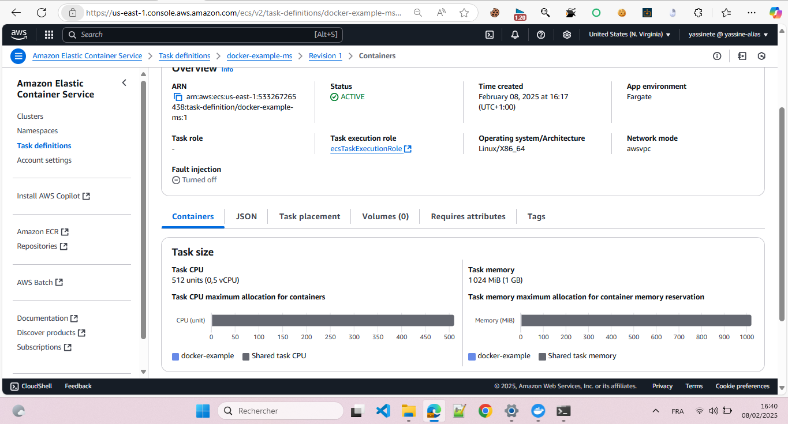
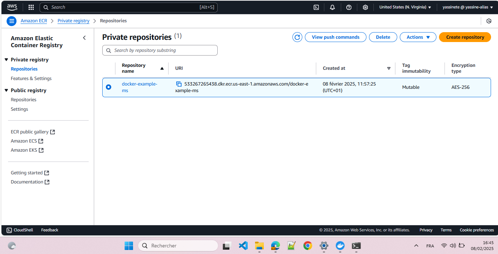

# Project Docker AWS ECS 🚀

Ce projet montre comment déployer une application Docker sur **AWS ECS** avec **Fargate**. Il inclut la gestion des conteneurs avec **Amazon Elastic Container Registry (ECR)** et le déploiement via **ECS Task Definitions**.

## 📸 Aperçu

### 🎯 **Définition de la tâche ECS**

### 🔧 **Dépôt Amazon ECR**

## ⚙️ Technologies utilisées

- **Docker** 🐳 : Conteneurisation de l'application
- **Amazon ECS** 🏡 : Orchestration des conteneurs
- **AWS Fargate** ☁️ : Exécution serverless des conteneurs
- **Amazon ECR** 📦 : Stockage des images Docker

## 🚀 Déploiement

1. **Construire l’image Docker**  
   \`\`\`sh
   docker build -t mon-app .
   \`\`\`

2. **Se connecter à AWS ECR**  
   \`\`\`sh
   aws ecr get-login-password --region us-east-1 | docker login --username AWS --password-stdin <ID_DU_COMPTE>.dkr.ecr.us-east-1.amazonaws.com
   \`\`\`

3. **Tagger et pousser l’image**  
   \`\`\`sh
   docker tag mon-app:latest <ID_DU_COMPTE>.dkr.ecr.us-east-1.amazonaws.com/docker-example-ms
   docker push <ID_DU_COMPTE>.dkr.ecr.us-east-1.amazonaws.com/docker-example-ms
   \`\`\`

4. **Déployer la tâche ECS** via AWS Console ou AWS CLI.

## 🐝 Licence

Ce projet est sous licence MIT. Libre à vous de l’utiliser et de le modifier. 🎉

EOF
